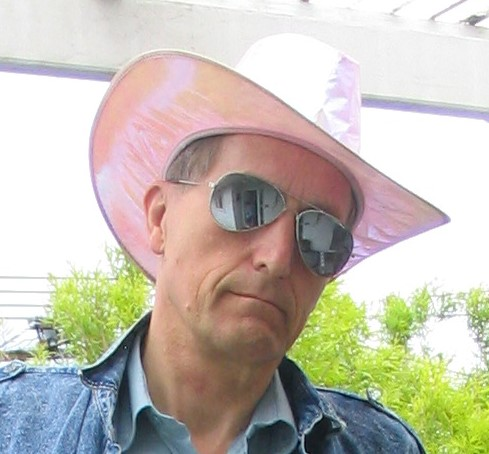

# Pipe Dreams

Pipe Dreams is a Unity 2020 project by Dr. Karl Scherer and Erik Hogan to create a virtual playground for assembling pipe knot puzzles.  

For more details, please [read the manual](page/MANUAL)

[Play Online (Unity WebGL)](https://earok.github.io/pipedreams/)

Dr. Karl Scherer

Erik Hogan

